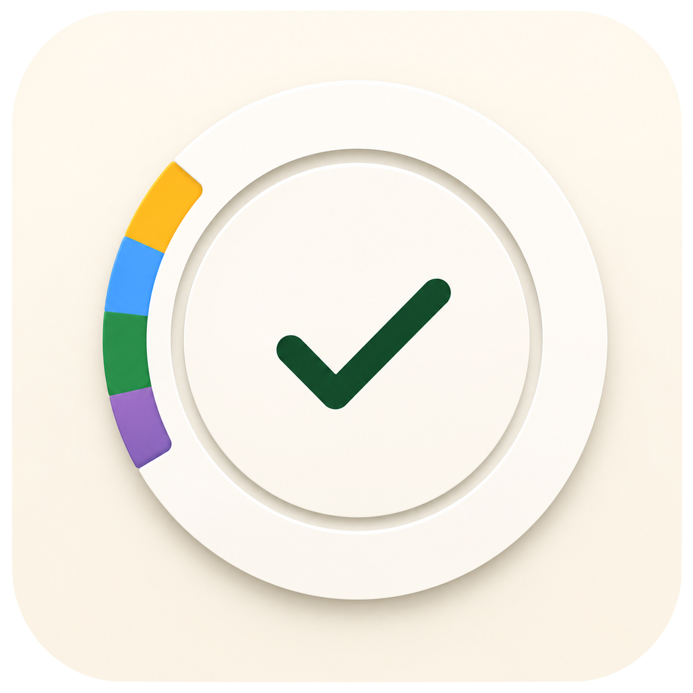
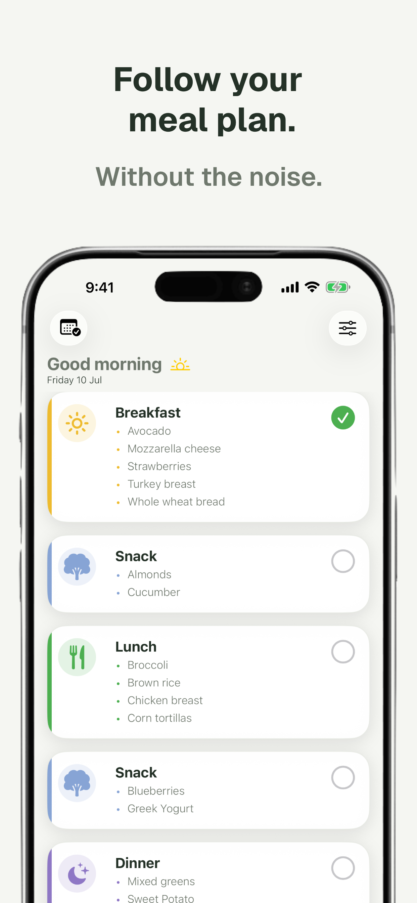

<p align="center">
  
</p>

<h1 align="center">Orumi</h1>

<p align="center">
  A calm place to follow your meal plan.
</p>

<p align="center">
  Orumi helps people follow an existing meal plan in a simple, organized and calm way.
</p>

---

## 📖 About

Following a meal plan shouldn't feel overwhelming.

Orumi is an iOS application designed for people who already have a meal plan created by a nutritionist or themselves. Instead of focusing on calorie counting or food tracking, Orumi helps users stay organized, know what comes next, and build consistency one meal at a time.

---

## 📱 Screenshot

<p align="center">
  
</p>

---

## ✨ Features

- 📅 Weekly meal organization
- 🍽️ Daily meal tracking
- ✅ Meal completion
- 📊 Daily progress summary
- 📆 Monthly history
- 💾 Offline-first experience

---

## 🧠 Philosophy

Orumi was built around one simple idea:

> **Following your meal plan should feel simple.**

The app intentionally avoids calorie counting, food logging, and unnecessary complexity.

Instead, it focuses on helping users follow the meal plan they already have.

**One meal at a time.**

---

## 🤔 Why Orumi?

Many nutrition apps focus on tracking everything you eat.

Orumi takes a different approach.

It assumes you already have a meal plan and simply helps you follow it consistently.

Nothing more.

Nothing less.

---

## 🛠 Tech Stack

- SwiftUI
- SwiftData
- Observation
- MVVM Architecture
- Offline-First Design
- iOS 26+

---

## 🏛 Architecture

The project follows the **MVVM** architecture, keeping business logic separated from the user interface.

### Principles

- Single Responsibility
- Reusable SwiftUI Components
- Offline First
- Native Apple Frameworks
- Composition over complexity

---

## 🎨 Design Principles

These principles guide every feature and design decision in Orumi.

- Calm before colorful.
- One primary action per screen.
- Reduce friction whenever possible.
- Accessibility is a feature.
- Native first.
- Offline by default.

---

## 🚀 Getting Started

### Requirements

- Xcode 26+
- iOS 26 SDK

### Clone the repository

```bash
git clone https://github.com/<your-username>/orumi.git
```

### Open the project

```bash
open Orumi.xcodeproj
```

Run the app on an iOS Simulator or a physical device.

---

## 🗺 Roadmap

Some planned improvements include:

- Accessibility Pass
- Food Groups & Equivalences
- Custom Meal Structure
- Weekly Grocery List
- Widgets
- Smart Reminders
- Torti Companion
- User Profile

---

## 🤝 Contributing

Contributions, ideas, and feedback are always welcome.

Feel free to open an Issue or submit a Pull Request.

---

## 📄 License

This project is licensed under the MIT License.

---

<p align="center">
Designed and developed by <strong>Guillermo Saavedra</strong> • One meal at a time.
</p>
